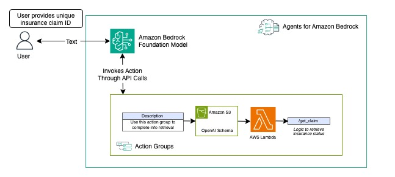

# Terraform Implementation of Amazon Bedrock Agent 

This sample solution demonstrates the implementation of an Amazon Bedrock Agent capable to retrieving insurance claim information based on user input. The prompt templates can be modified to accomodate various use cases.

## Requirements

- [Sign up for an AWS account](https://portal.aws.amazon.com/gp/aws/developer/registration/index.html) if you don't have an existing account and sign in. Please ensure that your user have the necessary IAM permissions to access AWS resources.

- [AWS CLI](https://docs.aws.amazon.com/cli/latest/userguide/install-cliv2.html) installed.

- [Git CLI](https://git-scm.com/book/en/v2/Getting-Started-Installing-Git) installed.

- [Terraform CLI](https://learn.hashicorp.com/tutorials/terraform/install-cli?in=terraform/aws-get-started) installed.

## Architecture Overview


## Implemantation

### Step 1: Clone this repository.
```
git@ssh.gitlab.aws.dev:olivha/terraform_bedrock_agent.git
```

### Step 2: Initialise the directory.
```
terraform init
```

### Step 3: Apply infrastructure.
```
terraform apply
```

## Validation
* Login to AWS account 
* Navigate to CloudFormation from console and verify that resources were created successfully

## (Optional) Clean up the infrastructure 
* Enter the following command to clean up
```
terraform destroy
```

